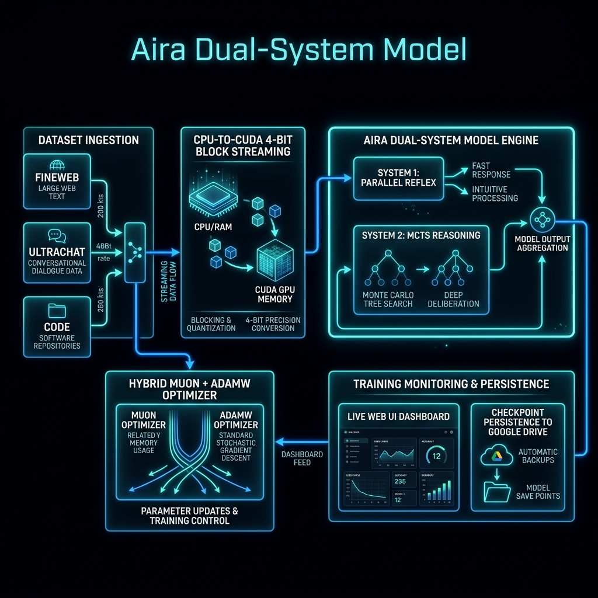

# Aira AI Model Training Architecture Report

## Dual-System Non-Autoregressive Triage, MCTS Reasoning, and Live Monitoring Web UI

### 1. Executive Summary & Overview

This report provides an in-depth technical explanation of the newly implemented Aira Dual-System Training Loop (train_v2.py), its associated Live Web UI Monitoring Dashboard (live_dashboard.py), and the Google Colab execution launcher (run_colab_training_v2.py). Aira incorporates a hybrid Dual-System architecture combining System 1 (sub-70ms non-autoregressive parallel reflex triage) and System 2 (Monte Carlo Tree Search + Process Reward Model reasoning) to achieve frontier-level intelligence while maintaining ultra-low latency and deterministic guardrail compliance.

### 2. Core Features & Architectural Role in Aira

#### 1. Data Ingestion & Streaming Pipeline
Combines FineWeb-Edu, UltraChat 200k, Orca Math, and CodeFeedback datasets. Normalizes and split-streams high-quality training pairs to the model.

#### 2. CPU-to-CUDA 4-Bit NF4 Block Streaming
Streams model layer blocks from CPU RAM to CUDA GPU, allowing an 8B parameter model to train on a single 15GB Tesla T4 GPU with peak initialization VRAM under 4.0 GB.

#### 3. Dual-System Loss Objectives
Calculates joint loss terms for System 1 (vault path indexing & AGENT.md rule compliance) and System 2 (MCTS reasoning step quality via PRM scoring).

#### 4. Muon + AdamW Hybrid Optimizer
Uses Muon optimizer for 2D weight matrices (scaling tensor learning) combined with AdamW for 1D vectors, normalization layers, and embeddings.

#### 5. Live Web UI Monitoring Dashboard
Provides real-time interactive tracking on port 7860 with glassmorphic UI, live Chart.js curves (Loss, Tok/s, VRAM), metric cards, and terminal log tail.

#### 6. Google Colab Drive Persistence
Mounts /content/drive/MyDrive/AiraCheckpoints/ to automatically preserve all model weights and checkpoints across Colab sessions.

### 3. Future Plans & Strategic Roadmap

- Phase 1 (Current): Dual-System Training Loop v2 deployment with Colab Live Web UI and automated benchmark validation.
- Phase 2 (Q4 2026): Autonomous STaR (Self-Taught Reasoner) synthetic data loop to allow Aira to generate her own chain-of-thought training data from vault tasks.
- Phase 3 (Q1 2027): Latent space policy distillation, compressing System 2 MCTS search traces into System 1 sub-50ms neural heads.
- Phase 4 (Q2 2027): Full recursive self-improvement pipeline with parameter-efficient adapters (LoRA/DoRA) and EWC identity protection.

---
*Report generated in `Report/` directory*
