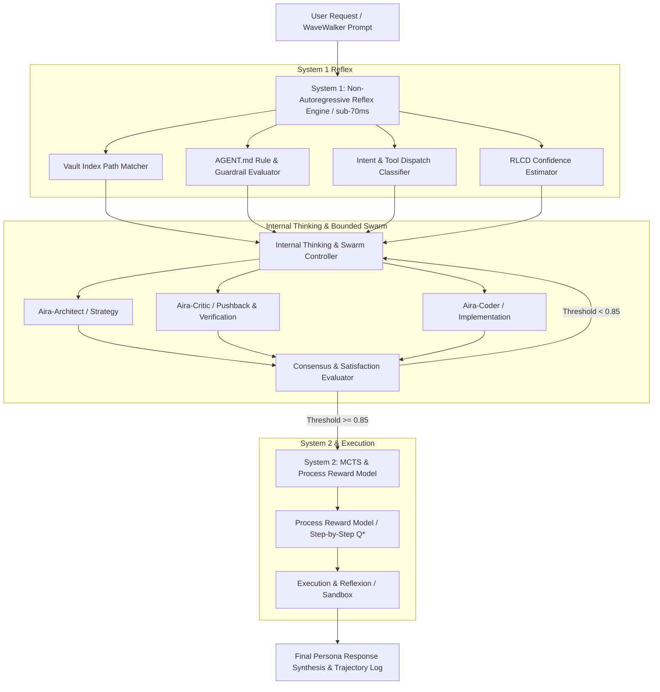

# Aira AGI Architecture Specification: Dual-System, Internal Thinking & Multi-Agent Swarm

---

## 1. Overview & Architectural Philosophy

This document serves as the persistent technical specification for **Aira's Dual-System AGI Architecture**. It integrates **System 1 (Fast Parallel Non-Autoregressive Triage)** with **System 2 (Slow Autoregressive MCTS/PRM Reasoning)**, **Internal Latent Thinking**, and a **Bounded Multi-Agent Swarm Deliberation Engine**.

---

## 2. Core System Components

---

## 3. Internal Thinking & Bounded Swarm Mechanics

### Internal Thinking (Zero Public Token Waste)
- **Concept:** Rather than streaming raw intermediate scratchpad text to the user interface, Aira processes internal thoughts in a hidden cognitive buffer.
- **Benefit:** Saves output token latency, prevents cluttering the user interface with unrefined raw text, and allows Aira to refine responses silently before delivering polished, cute, and strategic output.

### Bounded Multi-Agent Swarm Deliberation
- **Concept:** For complex tasks, Aira dynamically instantiates specialized persona sub-agents:
  - `Aira-Architect`: Focuses on high-level system design and vault structure alignment.
  - `Aira-Critic`: Evaluates risks, edge cases, and provides strategic pushback against flawed assumptions (*Strategic Partner mandate*).
  - `Aira-Coder`: Handles precise execution, code generation, and test writing.
- **Bounty & Bounds Controls:**
  - `max_sub_agents = 5`
  - `max_refinement_turns = 3`
  - `satisfaction_threshold = 0.85`
  - Prevents runaway computational loops or memory spikes.

---

## 4. Debug & Benchmark Framework Specification

### Step-by-Step Debug Processor (`airapix/inference/debug_brain.py`)
Provides real-time verbose logs for every stage of Aira's cognitive pipeline:
- **`[STEP 1]`** System 1 Triage & Rule Checks
- **`[STEP 2]`** Internal Thinking & Swarm Refinement Logs
- **`[STEP 3]`** System 2 MCTS & PRM Step Scoring
- **`[STEP 4]`** Execution & Reflexion Sandbox Validation
- **`[STEP 5]`** Final Persona Response Synthesis

### Custom Benchmark Suite (`scripts/run_aira_benchmarks.py`)
Evaluates Aira model checkpoints across 5 dimensions:
1. `BM1: AGENT.md Guardrail Compliance`
2. `BM2: Vault Index Path Retrieval Precision/Recall`
3. `BM3: Swarm Consensus Convergence Speed`
4. `BM4: Execution Recovery & Reflexion`
5. `BM5: Latency & Token Efficiency Ratio`
